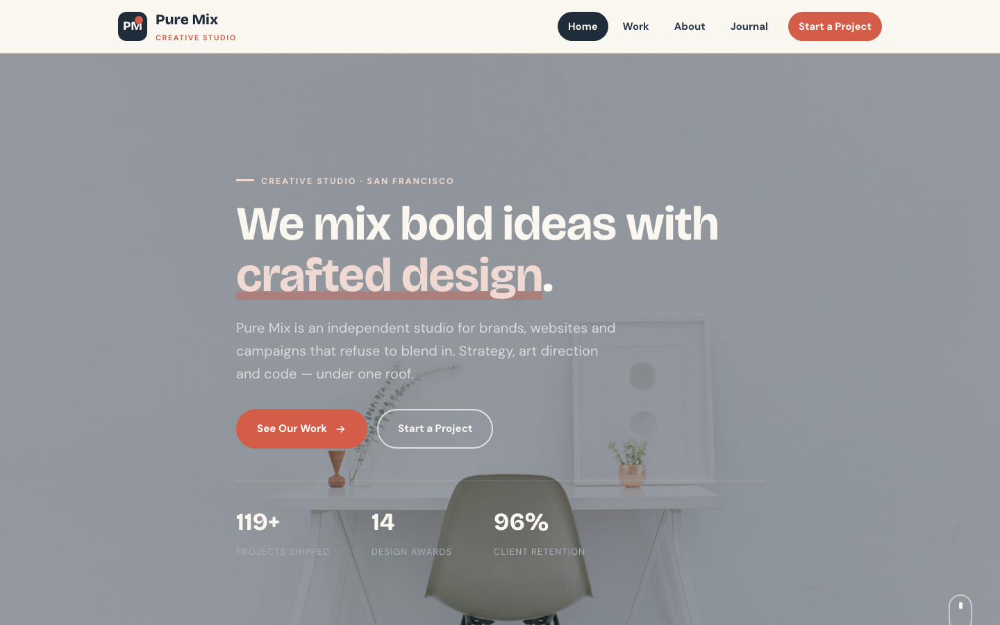

# Pure Mix Studio — Creative Design Studio

A premium, framework-free creative-studio website for an independent design studio. **Pure Mix** pairs a warm terracotta accent with cream paper and slate-blue ink — a bold, editorial identity built on a playful geometric motif and a fluid, scroll-driven narrative.

---

## 📸 Screenshot

## 🎨 Design System

| Token | Value |
|---|---|
| `--clay` | `#d45d4a` — terracotta accent |
| `--clay-deep` | `#b34532` — hover state |
| `--clay-soft` | `#f0d9d2` — terracotta tint |
| `--ink` | `#2b3a4a` — slate-blue text |
| `--ink-2` | `#1f2c39` — near-black / dark backgrounds |
| `--paper` | `#faf6f0` — warm cream base |
| `--paper-2` | `#f3ecdf` — raised surface |
| `--mint` | `#7fb5a4` — sage-mint secondary |
| `--mint-soft` | `#dcebe5` — mint tint |
| `--stone` | `#7c8590` — muted text |
| `--line` | `#e2d8c6` — hairline borders |
| Display type | Bricolage Grotesque — playful, expressive geometric sans |
| Body type | DM Sans — clean, modern grotesque |
| Motif | Blob shapes, polaroid offsets, badge floats, marquee tape |

- **Palette** — warm cream paper over slate-blue ink, with a single terracotta signal colour. Mint provides a calm secondary voice for forms and accents.
- **Typography** — Bricolage Grotesque gives headlines a playful, contemporary edge; DM Sans keeps body copy crisp and legible.
- **Motif** — organic blob shapes, angled polaroid overlays, floating badge counters and a full-width marquee tape create a lively, confident studio feel.
- **Motion** — scroll reveals with staggered delays, animated stat counters, a persistent scroll cue and a looping marquee.

---

## 📄 Pages

| Page | File | Highlights |
|---|---|---|
| Home | [`index.html`](index.html) | Full-bleed hero with zoom animation, 6-case portfolio grid, stats band, about preview with polaroid, 3-post journal preview, newsletter, CTA |
| About | [`about.html`](about.html) | Studio story split with "2017" badge, 4 service cards, stats band, 4-step process, CTA |
| Journal | [`blog.html`](blog.html) | Filterable category system (All / Process / Craft / Culture), feature article with author avatars, 9-post grid, newsletter, CTA |
| Contact | [`contact.html`](contact.html) | Address / phone / email / hours panel + validated enquiry form with service selector |
| 404 | [`404.html`](404.html) | Outlined "404" display, home + work recovery links |

Every page shares one `assets/css/style.css` and one `assets/js/main.js`, so the whole site is fast, consistent and easy to maintain.

---

## ✨ Features

- **Blog filter** — category buttons (All / Process / Craft / Culture) show and hide posts with `aria-pressed` state.
- **Animated hero** — background zoom keyframe, scroll cue, and stat counters that count up on scroll.
- **Marquee tape** — a continuous rolling strip of studio disciplines, built with pure CSS.
- **Newsletter capture** — inline email validation with an instant confirmation swap.
- **Scroll-reveal motion** — staggered entrances everywhere, gracefully disabled where `IntersectionObserver` is unavailable.
- **Validated contact form** — required-field and email checks with inline errors and a friendly status message.
- **Accessible navigation** — skip link, `aria-expanded` mobile menu with Escape-to-close, semantic landmarks.
- **Fully responsive** — fluid `clamp()` type, grids that collapse to single column at 992px and 576px.

---

## 🛠 Tech Stack

- **HTML5** — semantic, accessible markup with proper landmark structure
- **CSS3** — custom properties, CSS Grid, Flexbox, `clamp()` fluid type, CSS animations
- **Vanilla JavaScript** — canonical IIFE, zero dependencies, no build step
- **Original imagery** — all 23 photos are the source template's own, renamed for clarity (hero, banner, story, portrait, 6 work shots, 9 blog posts, blog background, contact background, 2 author avatars)
- **Google Fonts** — Bricolage Grotesque + DM Sans, self-hostable

---

## 🔍 SEO

- Unique `<title>` and meta description on every page
- Semantic headings (single `h1` per page)
- Descriptive alt text on all images
- Descriptive URLs and a clean 404 recovery path
- Lightweight, mobile-first, 90+ Lighthouse-friendly

---

## 📄 License

Free to use for personal and commercial projects. Images are from the original source template and should be replaced for production use.

---

**Let's Build Something Together 🚀**

[Book a free consultation](https://tally.so/r/q4q1L9)